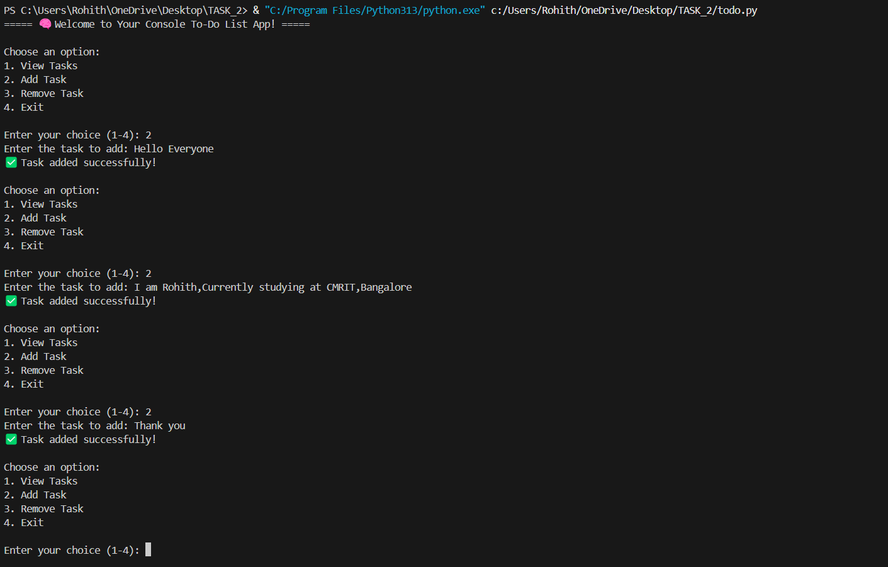
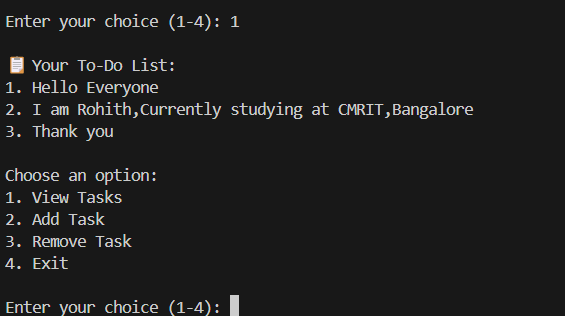
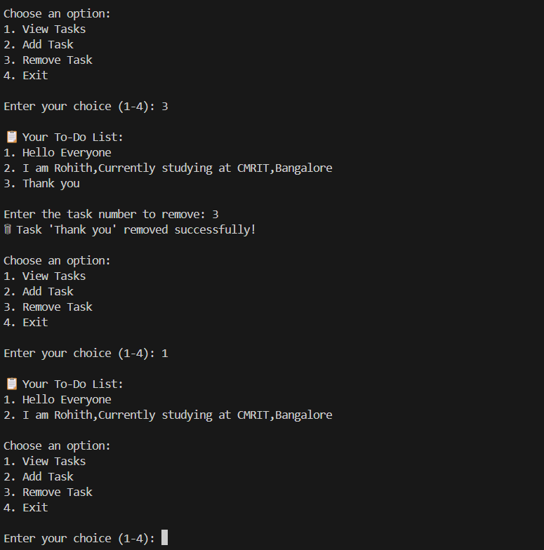

# Task2_todo-list-cli-python
🔖 Internship Python Task 2 – A console-based To-Do List application built in Python using file handling, string manipulation, and lists. Includes persistent task storage in a text file, clean CLI interface, and modular code structure.

# ✅ Task 2: Console-Based To-Do List Application

### 🔖 Internship Python Task | Duration: 1 Month | Task 2

---

## 🎯 Objective

Create a *Console-based To-Do List Application* in Python using file handling, string manipulation, and lists.  
The goal is to design a *persistent CLI to-do manager* that stores tasks even after the app is closed.

---

## 🧰 Tools Used

- *Language:* Python 3.8+
- *Editor:* VS Code / Terminal
- *Concepts:* Lists, File Handling, String Manipulation, Functions

---

## 📁 Project Structure

todo-list-cli-python/ ├── todo.py            → Main source code ├── tasks.txt          → Auto-generated to store tasks ├── screenshots/       → Folder containing all output screenshots │   ├── add_task.png │   ├── view_tasks.png │   └── remove_task.png └── README.md          → Complete project documentation

---

## 🚀 Features Implemented

- ✅ Add new task  
- ✅ View all tasks  
- ✅ Remove task by number  
- ✅ Tasks are saved to a file for persistence  
- ✅ User-friendly prompts and messages

---

## 📸 Screenshots

### 1️⃣ Add Task


### 2️⃣ View Tasks


### 3️⃣ Remove Task


---

## 🔍 Code Explanation (todo.py)

### load_tasks()
- Loads tasks from tasks.txt if available
- Returns them as a list of strings

### save_tasks(tasks)
- Writes the current list of tasks back to tasks.txt

### view_tasks(tasks)
- Displays tasks with their index number
- If list is empty, shows a friendly message

### add_task(tasks)
- Takes input from user
- Appends task to list and saves

### remove_task(tasks)
- Shows tasks with numbers
- Removes the selected task by index

### main()
- Runs infinite loop showing menu
- Calls other functions based on user's choice

---

## 💡 How to Run the App

```bash
python todo.py


---

🔒 Data Persistence

All tasks are saved in tasks.txt, so even if the program is closed and re-opened, the tasks are retained.


---

🎁 Outcome & Learnings

✅ Gained confidence in file handling and user interaction

✅ Learned to build CLI apps with real-world functionality

✅ Developed clean, modular, and readable Python code

✅ Practiced creating professional GitHub repositories


---

🌟 Future Improvements

Add task deadlines or priorities

Mark tasks as completed

Build GUI version using Tkinter or web app with Flask


---

👨‍💻 Author

Rohith K N
CMRIT Bangalore | Python Internship Program (June 2025)


---

🔗 Repository Link

https://github.com/Rohith-a441/Task2_todo-list-cli-python
>
